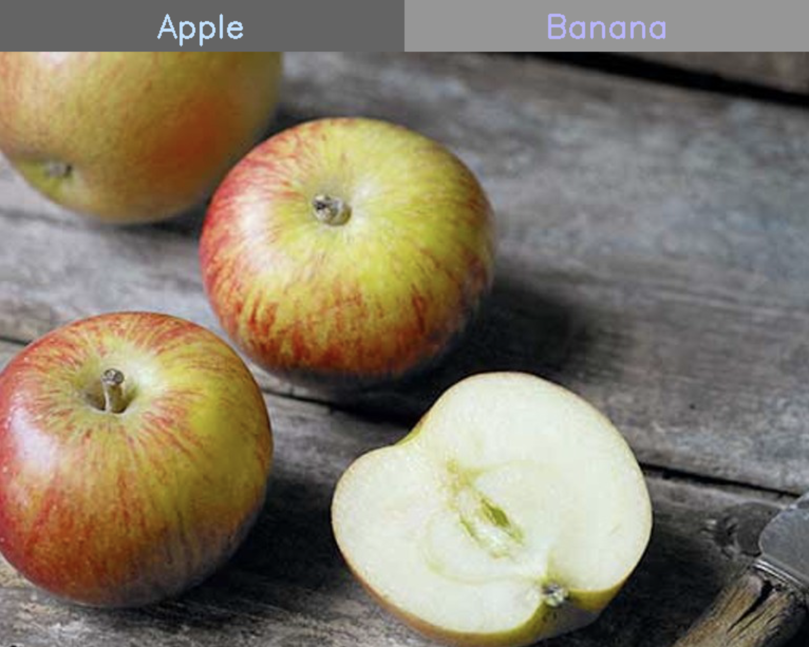
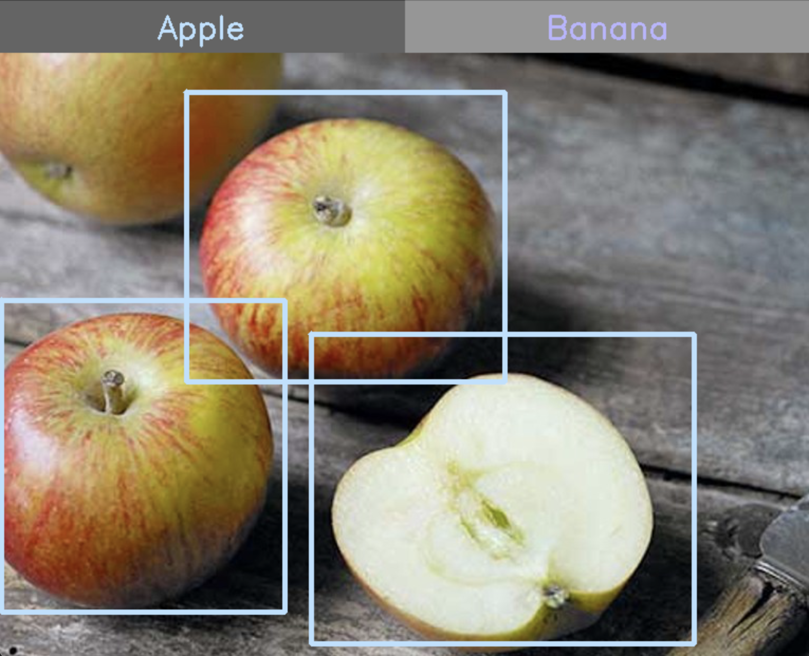

# Annotator

**Annotator** is a lightweight framework for constructing object detection annotations. It's built only
using OpenCV, with no other third-party libraries involved. The primary frontend consists of a makeshift GUI with buttons
corresponding to different labels and a two-click bounding-box creation interface, and the backend
parses the annotations and places the bounding box coordinates into text files corresponding to the images. 

## Installation

To use Annotator yourself, first clone this repository: 

```shell script
git clone https://github.com/amogh7joshi/annotator.git
```

Then, enter the directory and execute the following command to build the compiled program, which will be 
triggered by the `build.sh` build script:

```shell script
chmod +x ./build.sh
./build.sh
```

Now, you can edit the `config.txt` file with your own parameters for execution.
Each of the three lines corresponds to the following parameters:

1. The path to the directory containing images (or a directory containing directories of images).
2. The list of labels that you want to annotate, space-separated.
3. Whether to recursively search through the sub-directories of the parent path (either 'true' or 'false'.)

Finally, execute the following command and an annotator session will begin:

```shell script
./annotator
```

## Usage

After the Annotator window launches, it will sequentially load each of the images
in the directory path that you have provided. From here, you will be presented with a window
similar to the following image:



You can then use the two-click interface by clicking on a specific 
point of the image (excluding the buttons) and then clicking on a second point.
For each set of two clicks, a bounding box will appear. This will then be stored in a 
internal vector of bounding boxes alongside the selected label, and the process will repeat
for each bounding box on each individual image.



You can click on the different label buttons at the top to switch between labels,
and this will correspondingly be recorded internally and will appear as such in the 
output annotation text files. 

Additionally, the following keyboard shortcuts are part of Annotator:

1. **`q`**: Exit the session and close all windows.
2. **`c`**: Clear the annotations for the current image.

## License and Contributions

 

The code in this repository is licensed under the **Apache 2.0 License**,
see [LICENSE](LICENSE) for more details and terms of usage. If you have any contributions
that you feel may improve Annotator, feel free to contact me at `joshi.amoghn@gmail.com`, and
if you notice any pressing issues, don't hesitate to head to the Issues portion of the repository
and let me know.


